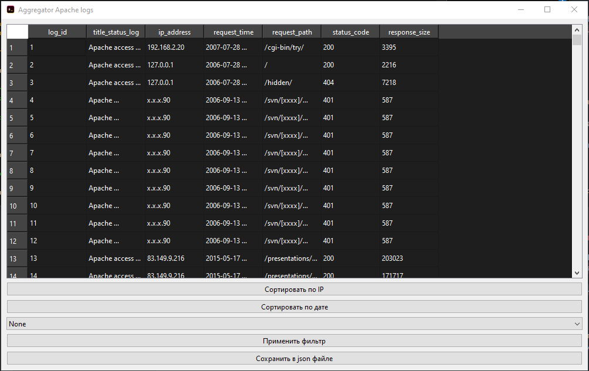
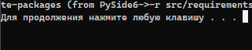
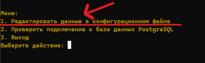
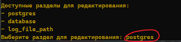
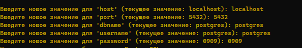

# Aggregator Apache Logs

## Описание проекта

Данный проект создан исключительно в образовательных целях. Он представляет собой программу, которая парсит логи из указанного в ` config.json ` файла, сохраняет данные в PostgreSQL и отображает их в таблице.

## Установка

1. Откройте файл [`installer.bat`](bin/installer.bat) в папке проекта, после чего дождитесь окончания загрузки.

2. В конце он попросит вас нажать на любую клавишу и закроется, когда вы это сделаете.

    

3. Все, теперь, если не возникли никаких проблем, то у вас должны 
были установится все необходимы зависимости для `Python`.

## Использование

**Для использования данного проекта выполните следующие шаги:**

1. Запустите[ `start.bat`,](bin/start.bat) который находится в папке `bin`.

2. Теперь нам необходимо настроить в `config` вашу Базу данных, для этого нужно:

   * Выберите `"Редактировать данные..."` в консоли или точнее напишите `1`.
  
   
   * Далее введите `"postgres"`.
   
     
   * Заполните обязательные поля для настройки соединения.
     
       

    Примечание: Тут мы настаиваем вашу системную базу данных "postgres"

3. Теперь вам нужно указать где находятся ваши логи и как он называется, для этого: 
   * мы выбираем сново выбираем `"Редактировать данные..."`
   * пишем в консоль `log_file_path` 
   * Далее вы должны указать путь к нужному файлу.

4. После ввода данных программа проверит наличие базы данных `'practice'`, таблицы `'access_log'` и функции `'add_access_log'` для добавления данных в таблицу.

5. Затем парсер пройдется по файлу `'*.log'`, сохранит данные в нужном формате и добавит их в таблицу `'access_log'`.

6. Наконец, откроется форма программы `Aggregator Apache Logs`, где вы сможете сортировать таблицу по **IP** и по **дате**, а также фильтровать данные по **IP**. Также вы можете сохранить логи в формате **JSON**, открыв форму редактирования сохранения в файле `'src/outputs/result.json'`.

## Требования
### Для работы проекта необходимы следующие компоненты:

* **Python 3.x**
* **PostgreSQL**

### Необходимые зависимости для `Python`

* **psycopg2-binary**
* **PySide6**
* **colorama**

## Лицензия:

* **Python 3.x**: Python является программным обеспечением с открытым исходным кодом, распространяемым по лицензии Python Software Foundation License (PSFL). Эта лицензия является довольно мягкой и позволяет свободно использовать и модифицировать язык Python. Подробнее о лицензии Python Software Foundation License можно узнать на официальном сайте Python Software Foundation (https://www.python.org/psf/license/).

* **psycopg2-binary**: psycopg2-binary является библиотекой Python для работы с PostgreSQL. Она распространяется под лицензией GNU Lesser General Public License (LGPL) версии 3 или более поздней. Эта лицензия обеспечивает свободу использования и распространения библиотеки в коммерческих и открытых проектах, при условии соблюдения некоторых требований, указанных в лицензии. Подробнее о лицензии GNU LGPL можно узнать на сайте Free Software Foundation (https://www.gnu.org/licenses/lgpl-3.0.html).

* **PySide6**: PySide6 является библиотекой Python для создания графического интерфейса пользователя (GUI). Она распространяется под лицензией GNU Lesser General Public License (LGPL) версии 2.1 или более поздней, а также под лицензией GNU General Public License (GPL) версии 3 или более поздней. Обе лицензии обеспечивают свободу использования и распространения библиотеки в коммерческих и открытых проектах. Подробнее о лицензиях GNU LGPL и GNU GPL можно узнать на сайте Free Software Foundation (https://www.gnu.org/licenses/lgpl-2.1.html и https://www.gnu.org/licenses/gpl-3.0.html).

* **colorama**: colorama является библиотекой Python для добавления цветового вывода в консоль. Она распространяется под лицензией BSD-3-Clause License. Эта лицензия позволяет свободно использовать, модифицировать и распространять библиотеку в коммерческих и открытых проектах, при условии соблюдения некоторых требований, указанных в лицензии. Подробнее о лицензии BSD-3-Clause можно узнать на сайте Open Source Initiative (https://opensource.org/licenses/BSD-3-Clause).

* **PostgreSQL**: PostgreSQL является системой управления базами данных с открытым исходным кодом и распространяется под лицензией PostgreSQL License, также известной как PostgreSQL BSD License. Эта лицензия позволяет свободно использовать, модифицировать и распространять PostgreSQL в коммерческих и открытых проектах, при условии соблюдения некоторых требований, указанных в лицензии. Подробнее о лицензии PostgreSQL BSD License можно узнать на сайте PostgreSQL (https://www.postgresql.org/about/licence/).

